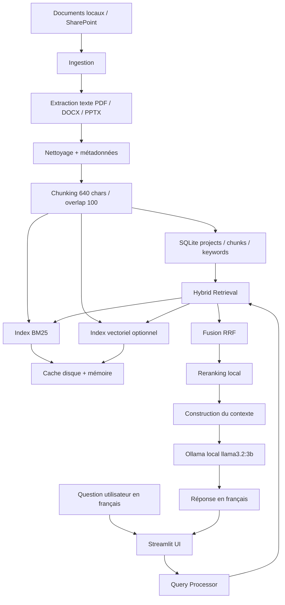

# Assistant de connaissances Safran

Cet outil est une solution interne, hors ligne et orientée R&D pour rechercher des documents techniques Safran. Il ingère des fichiers PDF, Word et PowerPoint depuis un dossier local ou SharePoint, stocke le texte extrait dans SQLite, construit un index BM25 et un index vectoriel optionnel, puis affiche des résultats triés avec une réponse justifiée dans une interface Streamlit.

Aucune API externe n'est utilisée au runtime. La recherche vectorielle optionnelle nécessite un modèle local compatible déjà présent sur le réseau d'entreprise.

## Architecture



### Lecture du pipeline

1. **Ingestion**
   - Les documents sont lus depuis un dossier local ou SharePoint.
   - Les extracteurs récupèrent le texte des fichiers PDF, DOCX et PPTX.
   - Le contenu est découpé en chunks courts avec chevauchement.
   - Les métadonnées et le texte sont persistés dans SQLite.
   - Les index BM25 et vectoriel sont construits une seule fois à l'ingestion.

2. **Recherche**
   - La question de l'utilisateur est analysée en français.
   - Le moteur lance une recherche hybride BM25 + vecteurs.
   - Les résultats sont fusionnés avec Reciprocal Rank Fusion.
   - Un reranker local garde les meilleurs candidats.

3. **Génération**
   - Le contexte utile est reconstruit à partir des meilleurs fragments.
   - Les doublons sont réduits avant envoi au modèle.
   - Ollama `llama3.2:3b` génère une réponse en français.
   - Streamlit affiche la réponse en streaming avec les sources et les preuves.

### Résumé en une ligne

```text
Documents -> extraction -> chunking -> indexation -> hybrid retrieval -> rerank -> contexte -> Ollama -> réponse française sourcée -> UI
```

## Démarrage rapide

```bash
cd safran-knowledge-assistant
python -m venv .venv
source .venv/bin/activate
pip install -r requirements.txt
cp .env.example .env
python scripts/create_sample_docs.py --scale 3
python scripts/ingest_local.py --path ./sample_docs --reset
streamlit run ui/app.py
```

Sur Windows, utilisez `.venv\\Scripts\\activate` à la place de `source .venv/bin/activate`.

## LLM Local

L'assistant utilise désormais uniquement le service local Ollama, avec le modèle `llama3.2:3b`:

```text
LOCAL_LLM_SERVICE_URL=http://127.0.0.1:11434
LOCAL_LLM_SERVICE_MODEL=llama3.2:3b
LOCAL_LLM_TIMEOUT=20
```

Si Ollama n'est pas disponible, l'application revient automatiquement aux réponses extractives justifiées. Dans tous les cas, le prompt demande une réponse en français.

La réponse est streamée dans l'interface dès que le modèle commence à générer le texte.

## Configuration SharePoint

Renseignez ces valeurs dans `.env` :

```text
SHAREPOINT_URL=https://votre-site-sharepoint
SHAREPOINT_USERNAME=DOMAINE\\utilisateur
SHAREPOINT_PASSWORD=votre-mot-de-passe
SHAREPOINT_LIBRARY=Documents
```

Puis exécutez :

```bash
python scripts/ingest_sharepoint.py --check
python scripts/ingest_sharepoint.py
```

Le paramètre `--check` permet de valider les identifiants et de lister les premiers fichiers trouvés. Les échecs sont enregistrés et ignorés pour ne pas bloquer l'ingestion complète.

## Recherche vectorielle

La recherche vectorielle est désactivée par défaut. Pour l'activer hors ligne :

1. Téléchargez un modèle compatible sur une machine connectée à Internet.
2. Copiez le dossier du modèle sur le réseau d'entreprise.
3. Installez les dépendances optionnelles depuis le miroir interne : `sentence-transformers`, `faiss-cpu`.
4. Définissez :

```text
EMBEDDING_MODEL_NAME=sentence-transformers/paraphrase-multilingual-mpnet-base-v2
USE_VECTOR_SEARCH=true
```

Le code essaie d'abord `BAAI/bge-m3`, puis `paraphrase-multilingual-mpnet-base-v2`, puis `multilingual-e5-base`, en restant strictement local si le modèle est déjà présent en cache ou sur disque.

Puis reconstruisez les index :

```bash
python scripts/rebuild_index.py
```

## Structure du projet

```text
config.py                  paramètres via variables d'environnement
db/                        schéma SQLite, modèles et accès aux données
ingest/                    ingestion locale/SharePoint et extracteurs
search/                    BM25, recherche vectorielle optionnelle, fusion hybride
assistant/                 traitement des requêtes, résumé, génération de réponses
ui/app.py                  application Streamlit
scripts/                   scripts opérationnels
tests/                     tests Pytest
```

## Tests

```bash
pytest
```

Les tests génèrent des documents DOCX/PPTX synthétiques et valident l'ingestion locale, la recherche BM25, la fusion hybride, le générateur de réponses, et le branchement Ollama.

## Limites connues et prochaines étapes

- Les pages PDF purement images sont ignorées ; une OCR hors ligne peut être ajoutée plus tard.
- Les métadonnées SharePoint varient selon l'environnement ; l'ingestion locale utilise la date de modification du système de fichiers.
- Les réponses sont générées par Ollama local, avec streaming dans l'interface.
- La recherche vectorielle dépend de dépendances optionnelles et d'un modèle local.
- Le filtrage des droits d'accès n'est pas encore implémenté ; il faut le renforcer avant un déploiement large.

## Format de réponse actuel

L'interface affiche désormais une réponse directe en français en premier, puis la confiance, les limites, les citations de sources et les fragments de preuve détaillés.

Utilisez `python scripts/create_sample_docs.py --scale 3` pour générer un corpus de démonstration plus volumineux couvrant le radar FPGA, la navigation UAV, la fusion inertielle/GNSS, la vérification avionique, la cybersécurité et le traitement IA embarqué.
